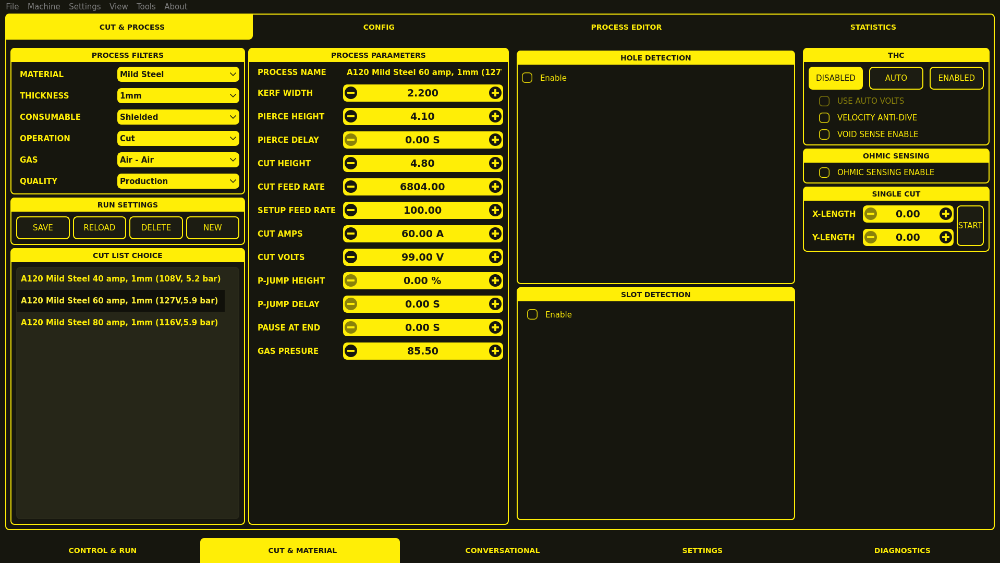
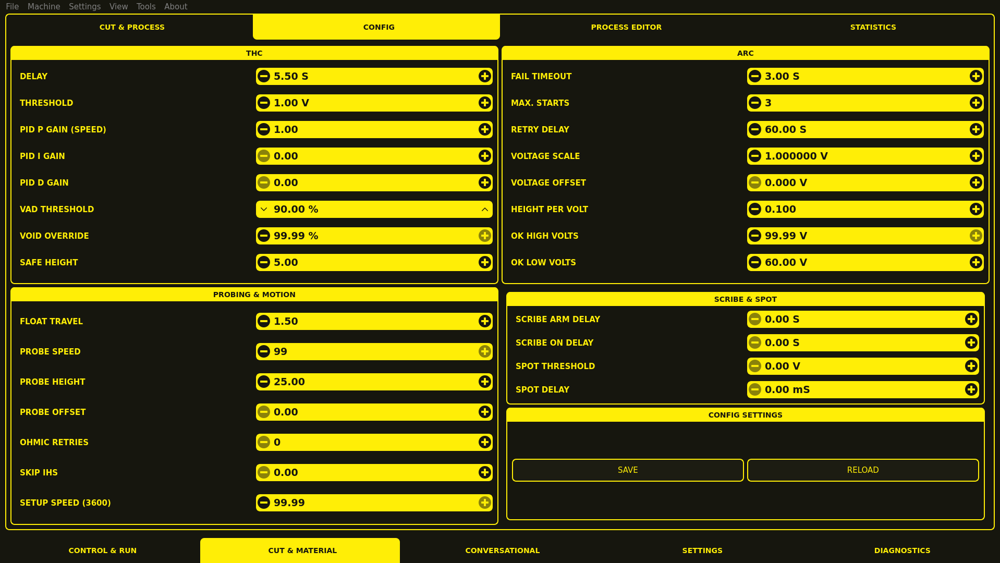

# MonoKrom Virtual Control Panel

Monochrome style VCPs for LinuxCNC controlled Lathes, Mills and Plasma cutters.

*Mill*


*Plasma*






## Installation


If you have not already done so, install the [QtPyVCP software dependencies](http://www.qtpyvcp.com/install/prerequisites.html#software-dependencies)

*Dependency*

Monokrom plasma requires the plasma_db branch from qtpyvcp.  To get access to this branch it is recommended to use a developer install of qtpyvcp. If you already have such an install you will need to install sqlalchemy via pip.

If you have yet to install a developer version of qtpyvcp then BEFORE performing the pip install per normal dev instructions you need to

`git checkout plasma_db`

THEN

`python3 -m pip install -e .`


Install MonoKrom (includes mill and plasma VCPs)

The current Plasma development version which is under active development is located at:
https://github.com/joco-nz/monokrom-vcp

If the Plasma UI is of interest then the recommended install is:

```
cd <directory where you want to have the git cloned repo>
git clone https://github.com/joco-nz/monokrom-vcp
cd monokrom-vcp
python3 -m pip install -e .
```
This will create an editable installe of Monokrom.  To update to the latest development state cd into monokrom-vcp and perform

`git pull`


To install the MonoKrom LinuxCNC sim configs run:

`monokrom --install-sim`


## Final Adjustments
This section collects the final "tweaks" that may be needed to get success.

[1] Ensure there is write access to /tmp
The simplest is to assume the access permissions looks like:
```
drwxrwxrwt  26 root root  4096 Dec 20 21:26 tmp
```

If adjustment is needed use the command:
```
sudo chmod o+rw tmp
```


## Acknowledgements

Designed by: [@pinder](https://forum.linuxcnc.org/cb-profile/pinder)  
Forum Thread: [forum.linuxcnc.org/qtpyvcp/40082](https://forum.linuxcnc.org/qtpyvcp/40082)
