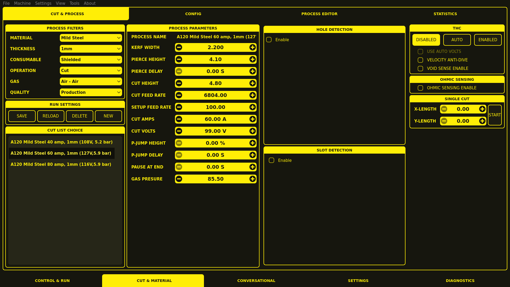
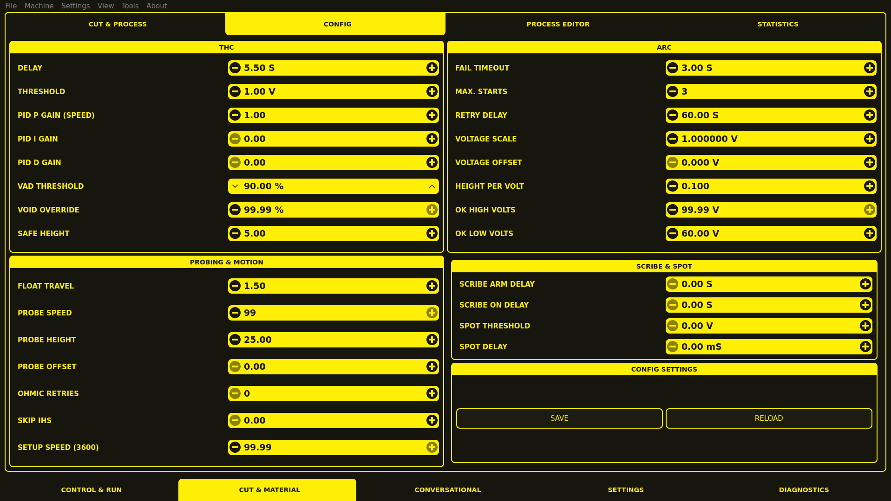

# MonoKrom Virtual Control Panel

Monochrome-style VCPs (Virtual Control Panels) for LinuxCNC-controlled lathes, mills, and plasma cutters.

## Projects

| Project    | Description                                       | Status             |
| ---------- | ------------------------------------------------- | ------------------ |
| **Mill**   | Milling machine VCP                               | Stable             |
| **Plasma** | Plasma cutting VCP with THC, probing, Quickshapes | Active development |

## Plasma VCP

A feature-rich plasma cutting interface built on [QtPyVCP](https://www.qtpyvcp.com/) with:

- **Process Filter Database** — SQLite-backed cut parameter management with multi-field filtering (gas, machine, material, thickness, consumable)
- **14 Quickshape Primitives** — Circle, rectangle, donut, flanges, gussets, truss supports, and more
- **Cut Recovery** — 8-directional jog pad for recovering from interrupted cuts
- **Consumable Change** — Automated X/Y offset management for tip/wheel changes
- **Sheet Alignment** — Two-point coordinate system rotation with laser offset compensation
- **VTK Backplot** — 3D visualization of G-code programs with breadcrumbs and WCS support
- **Process Logging** — Cut length, time, and arc OK statistics
- **THC** — Thermal Height Control with PID tuning, VAD, void sensing, mesh mode
- **Probing** — Ohmic probe and float switch support
- **MDI Assistance** — G-code word parameter lookup with suggestion buttons

### Screenshots





## Installation

### Prerequisites

- Linux (Debian 12/Bookworm recommended)
- Python 3.7+
- PySide6
- LinuxCNC (master branch, v2.10+)

### Step 1: Install QtPyVCP

MonoKrom Plasma requires a forked branch of qtpyvcp that adds the SQLite-backed plasma
processes plugin. Choose the branch that matches your Debian version:

| Debian Version       | Branch    |
| -------------------- | --------- |
| Debian 12 (Bookworm) | `main`    |
| Debian 13 (Trixie)   | `pyside6` |

```bash
git clone https://github.com/kcjengr/qtpyvcp
cd qtpyvcp
git checkout main    # Debian 12
# git checkout pyside6  # Debian 13
python3 -m pip install -e .
```

If you already have a developer install of qtpyvcp, switch to the appropriate branch and
install SQLAlchemy:

```bash
cd <your-qtpyvcp-directory>
git checkout main    # Debian 12
# git checkout pyside6  # Debian 13
python3 -m pip install sqlalchemy
```

### Step 2: Install MonoKrom

```bash
cd <directory where you want the repo>
git clone https://github.com/joco-nz/monokrom-vcp
cd monokrom-vcp
python3 -m pip install -e .
```

This creates an editable install. To update to the latest development version:

```bash
cd monokrom-vcp
git pull
python3 -m pip install -e .
```

### Step 3: Install Simulation Config

```bash
monokrom --install-sim
```

This copies the simulation configuration files to `~/linuxcnc/configs/sim.monokrom/`.

### Step 4: Start LinuxCNC Simulator

```bash
linuxcnc ~/linuxcnc/configs/sim.monokrom/plasmac/plasmac_sim.ini
```

## Documentation

Full documentation is available in the `docs/` directory, built with Sphinx:

- [Overview](docs/overview.md) — Architecture and feature comparison
- [Quick Start](docs/quick-start.md) — Installation and first run
- [User Guide](docs/user-guide/index.md) — Operating the VCP
- [Integrator Guide](docs/integrator-guide/index.md) — Hardware setup and configuration
- [Reference](docs/reference/index.md) — HAL pins, settings, G-code syntax
- [Developer Guide](docs/developer-guide.md) — Extending the VCP
- [Changelog](docs/changelog.md) — Release notes

### Building Documentation Locally

```bash
cd docs
pip install -e .[docs]  # or: pip install sphinx myst-parser sphinx-rtd-theme
make html
```

Open `docs/_build/html/index.html` in a browser.

## Final Adjustments

### Write Access to /tmp

Ensure there is write access to `/tmp`:

```bash
# Check permissions (should be drwxrwxrwt)
ls -ld /tmp

# If needed, fix permissions:
sudo chmod o+rw /tmp
```

## Acknowledgements

Designed by: [@pinder](https://forum.linuxcnc.org/cb-profile/pinder)  
Forum Thread: [forum.linuxcnc.org/qtpyvcp/40082](https://forum.linuxcnc.org/qtpyvcp/40082)

MonoKrom Plasma draws functional inspiration from [QTPlasmaC](https://linuxcnc.org/docs/html/customizing/qtplasmac.html),
the stock LinuxCNC plasma cutting screen. QTPlasmaC served as the reference point for core
plasma cutting functionality including THC, probing, arc start, and cut management.

## Links

- [LinuxCNC](https://linuxcnc.org)
- [QtPyVCP](https://www.qtpyvcp.com)
- [QTPlasmaC](https://linuxcnc.org/docs/html/customizing/qtplasmac.html)
- [MonoKrom GitHub](https://github.com/joco-nz/monokrom-vcp)
