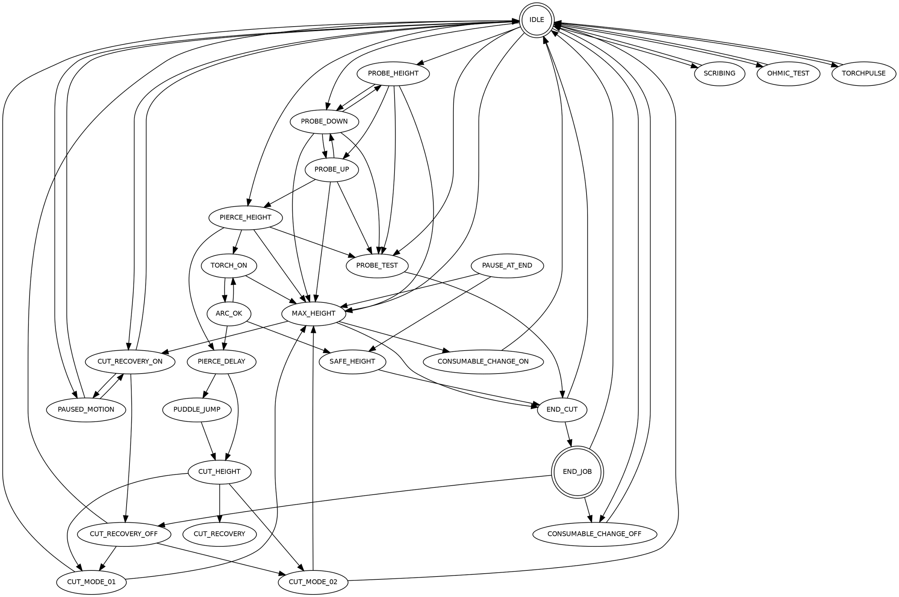

# State Machine

This page documents the internal state machine of MonoKrom Plasma (plasmac). Understanding
the state machine is essential for integrators wiring HAL connections and for developers
extending the plasma control logic.

## State Diagram



## State Descriptions

### Idle States

| State | Description |
|-------|-------------|
| `IDLE` | Machine is idle, ready for commands. Entry point after power-up or reset. |
| `END_JOB` | Cut job has completed. Final state before returning to IDLE. |

### Probing States

| State | Description |
|-------|-------------|
| `PROBE_HEIGHT` | Probing to find workpiece surface. Can transition to PROBE_DOWN, PROBE_UP, or MAX_HEIGHT. |
| `PROBE_DOWN` | Z axis moving down during probe. Can transition to PROBE_TEST, PROBE_UP, or MAX_HEIGHT. |
| `PROBE_UP` | Z axis moving up after probe detected. Can transition to PIERCE_HEIGHT or MAX_HEIGHT. |
| `PROBE_TEST` | Ohmic probe test mode. Transitions to END_CUT when complete. |
| `OHMIC_TEST` | Standalone ohmic probe test. Returns to IDLE when complete. |
| `SCRIBING` | Scribe mode (marking without cutting). Returns to IDLE when complete. |

### Pierce States

| State | Description |
|-------|-------------|
| `PIERCE_HEIGHT` | Torch at pierce height, waiting to ignite arc. Can transition to PIERCE_DELAY or TORCH_ON. |
| `PIERCE_DELAY` | Delay at pierce height before lowering to cut height. Transitions to CUT_HEIGHT or PUDDLE_JUMP. |

### Arc States

| State | Description |
|-------|-------------|
| `TORCH_ON` | Torch energized, waiting for arc transfer. Transitions to ARC_OK or MAX_HEIGHT. |
| `ARC_OK` | Arc established and stable. Transitions to SAFE_HEIGHT or PIERCE_DELAY (retry). |

### Cut States

| State | Description |
|-------|-------------|
| `CUT_HEIGHT` | Torch at cut height, ready to begin cutting. Transitions to CUT_MODE_01, CUT_MODE_02, or CUT_RECOVERY. |
| `CUT_MODE_01` | Normal cutting mode (Mode 0 or 1). Returns to IDLE or MAX_HEIGHT when complete. |
| `CUT_MODE_02` | Normal cutting mode (Mode 0 or 1). Returns to IDLE or MAX_HEIGHT when complete. |
| `CUT_RECOVERY` | Cut interrupted, entering recovery mode. |

### Height States

| State | Description |
|-------|-------------|
| `MAX_HEIGHT` | Z axis at maximum safe height. Entry point for recovery from errors. Can transition to END_CUT, CONSUMABLE_CHANGE_ON, or CUT_RECOVERY_ON. |
| `SAFE_HEIGHT` | Z axis at safe cutting height (above workpiece). Transitions to END_CUT. |

### Recovery States

| State | Description |
|-------|-------------|
| `CUT_RECOVERY_ON` | Cut recovery active, operator can jog to recovery point. Transitions to IDLE, CUT_RECOVERY_OFF, or PAUSED_MOTION. |
| `CUT_RECOVERY_OFF` | Cut recovery cancelled. Returns to IDLE or CUT_MODE_01/02. |
| `PAUSED_MOTION` | Motion paused (feed hold). Transitions to IDLE or CUT_RECOVERY_ON. |

### Consumable Change States

| State | Description |
|-------|-------------|
| `CONSUMABLE_CHANGE_ON` | Consumable change offset applied. Machine is at home position for operator to replace tip/wheel. Returns to IDLE. |
| `CONSUMABLE_CHANGE_OFF` | Consumable change offset removed. Returns to IDLE. |

### Special States

| State | Description |
|-------|-------------|
| `TORCHPULSE` | Torch pulse mode for difficult materials. Returns to IDLE when complete. |
| `END_CUT` | Cut operation complete, Z axis retracting. Transitions to IDLE or END_JOB. |
| `PAUSE_AT_END` | Pause at end of cut (if enabled). Transitions to MAX_HEIGHT or SAFE_HEIGHT. |

## State Transitions

### Common Transition Triggers

| Trigger | Description |
|---------|-------------|
| **Cycle Start** | Transitions from IDLE to PROBE_HEIGHT or PIERCE_HEIGHT |
| **Arc OK** | Transitions from TORCH_ON to ARC_OK |
| **Arc Fail** | Transitions from TORCH_ON to PIERCE_DELAY (retry) or MAX_HEIGHT (abort) |
| **Feed Hold** | Transitions from CUT_MODE_01/02 to CUT_RECOVERY |
| **Cycle Start (recovery)** | Transitions from CUT_RECOVERY to CUT_MODE_01/02 |
| **Abort** | Transitions from any state to MAX_HEIGHT |
| **End of Program** | Transitions from CUT_MODE_01/02 to SAFE_HEIGHT -> END_CUT -> END_JOB |
| **Consumable Change (HAL)** | Transitions from IDLE to CONSUMABLE_CHANGE_ON |
| **Probe Test (HAL)** | Transitions from IDLE to PROBE_TEST |
| **Ohmic Test (HAL)** | Transitions from IDLE to OHMIC_TEST |

### Error Recovery

When an error occurs (estop, limit switch, fault), the state machine transitions to
`MAX_HEIGHT` regardless of the current state. From `MAX_HEIGHT`, the operator can:

1. Clear the error condition
2. Return to `IDLE` for normal operation
3. Enter `CUT_RECOVERY_ON` if a cut was interrupted
4. Enter `CONSUMABLE_CHANGE_ON` if consumables need replacement

## State Machine in HAL

The current state is exposed via the HAL pin:

| Pin | Direction | Type | Description |
|-----|-----------|------|-------------|
| `plasmac.state` | OUT | s32 | Current state machine state (integer code) |
| `plasmac.state-name` | OUT | string | Human-readable state name |

State codes are defined in the plasmac source and may change between versions. Use the
`state-name` pin for human-readable diagnostics.

## State Machine Diagram (Text)

For integrators wiring custom HAL logic, here is a simplified view of the main cutting
flow:

```
IDLE -> PROBE_HEIGHT -> PROBE_DOWN -> PROBE_UP -> PIERCE_HEIGHT -> PIERCE_DELAY -> CUT_HEIGHT -> CUT_MODE_01 -> SAFE_HEIGHT -> END_CUT -> IDLE
                                                                                                         |
                                                                                                         +-> CUT_MODE_02 -> SAFE_HEIGHT -> END_CUT -> IDLE
                                                                                                         |
                                                                                                         +-> CUT_RECOVERY -> CUT_MODE_01/02 -> ...
```

Error path (from any state):
```
ANY_STATE -> MAX_HEIGHT -> END_CUT -> IDLE
                      -> CONSUMABLE_CHANGE_ON -> IDLE
                      -> CUT_RECOVERY_ON -> IDLE
```

## See Also

- [HAL Pin Map](hal-pin-map.md) — Full list of HAL pins including state indicators
- [Post-GUI HAL](../integrator-guide/postgui-hal.md) — Example HAL file wiring for state monitoring
- [Troubleshooting](../troubleshooting.md) — Common state machine issues and fixes
