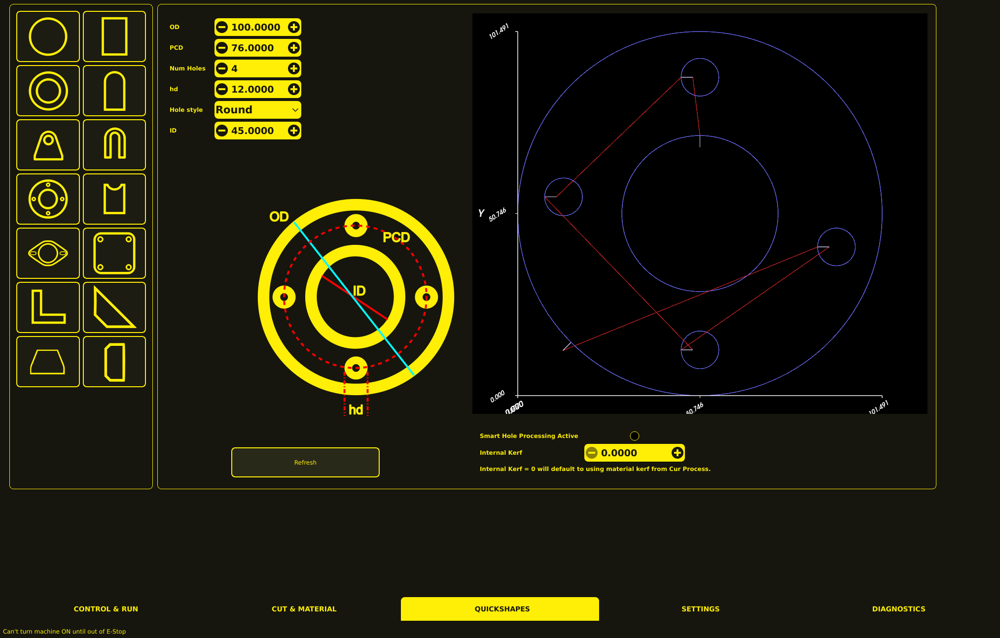

# Conversational (Quickshapes)

The Conversational tab provides 14 built-in shape primitives that generate complete G-code
programs. These are accessed via the **Quickshapes** tab at the bottom of the interface.



## Using Quickshapes

1. **Select a shape** — Click one of the 14 shape buttons (id0 through id13).
2. **Enter dimensions** — Fill in the parameter fields that appear below the shape buttons.
3. **Generate** — Click **REFRESH** to generate the G-code.
4. **Load** — The generated G-code appears in the editor. Review and load it to run.

## Shape Reference

| Index | Shape            | Description                                     | Key Parameters                                                  |
| ----- | ---------------- | ----------------------------------------------- | --------------------------------------------------------------- |
| 0     | Circle           | Circle with lead-in                             | Diameter                                                        |
| 1     | Rectangle        | Rectangle with lead-in                          | Width, Height                                                   |
| 2     | Donut            | Annulus (ring) with inner and outer cuts        | Outer Diameter, Inner Diameter                                  |
| 3     | Convex Rectangle | Rectangle with one rounded corner               | Width, Height, Corner Radius                                    |
| 4     | Lifting Lug      | Lifting lug with hole, optional pair            | Width, Height, Hole Position, Lug Thickness                     |
| 5     | U-Lug            | U-shaped lug                                    | Width, Height, Leg Width, Leg Length                            |
| 6     | Pipe Flange      | Pipe flange with center hole and bolt holes     | Outer Diameter, Bolt Circle Diameter, Hole Count, Hole Diameter |
| 7     | Pipe Saddle      | Pipe saddle profile                             | Pipe Diameter, Pipe Width, Saddle Depth                         |
| 8     | Exhaust Flange   | Exhaust flange with slot holes                  | Width, Height, Slot Count, Slot Width                           |
| 9     | N-Square Grid    | N-hole rectangle grid with optional center hole | Grid Spacing, Hole Count X, Hole Count Y, Hole Diameter         |
| 10    | L-Gusset         | L-shaped gusset                                 | Width, Height, Leg Width, Thickness                             |
| 11    | Angle Gusset     | Angle gusset with optional mirrored pair        | Width, Height, Leg Width, Thickness                             |
| 12    | Truss Support    | Truss support shape                             | Width, Height, Web Height                                       |
| 13    | Web Stiffener    | Web stiffener shape                             | Width, Height, Web Height                                       |

## Shape Features

All quickshape generators include:

- **Kerf compensation** — Cut paths are offset by the current kerf value from the selected material.
- **Smart hole detection** — Internal features that are smaller than the threshold defined in
  settings are cut as through-cuts (no lead-in needed).
- **Lead-ins** — External cuts use the configured lead-in type and length from the material
  settings.
- **Plasma start/stop sequences** — Each shape includes proper M3 (torch on) and M5 (torch off)
  commands with pierce and cut height settings.
- **Material selection** — Parameters are applied based on the currently selected material from
  the process database.

## G-code Structure

Each generated shape follows this structure:

```
; MonoKrom Quickshape - <shape name>
; Material: <selected material>
; Kerf: <kerf value>

(Start of shape program)
G0 Z<pierce height>      (Rapid to pierce height)
G1 Z<pierce height> F<probe speed>  (Probe approach)
(Ohmic probe or height sense)
G0 Z<pierce height>      (Rapid to pierce height)
G4 P<pierce delay>       (Pierce delay)
G1 Z<cut height> F<cut feed rate>  (Lower to cut height)
G4 P<pierce delay>       (Pierce delay at cut height)
M3                       (Torch on)
(Lead-in move)
G1 <cut path> F<cut feed rate>  (Cut path with kerf compensation)
M5                       (Torch off)
G0 Z<higher safe height> (Retract)
```

## Customizing Quickshapes

Quickshape parameters (kerf, lead-in type, hole detection threshold, etc.) are controlled by
the currently selected material in the process database. See [Parameters](parameters.md) for
details on managing materials and cut parameters.

To modify the shape geometry or add new shapes, see the [Developer Guide](../developer-guide.md).
