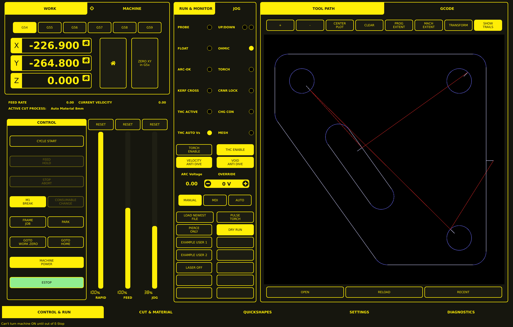

# Control & Run Tab

The Control & Run tab (labeled **CONTROL & RUN** in the bottom navigation bar) is the primary operational panel. It is divided into three vertical work areas: a coordinate and machine-controls area on the left, a monitoring and process-controls area in the center, and a tool-path and G-code visualization area on the right.



## Layout

The Control & Run screen is divided into three vertical areas:

| Area | Content |
|------|---------|
| **Left** | WORK and MACHINE tabs, coordinate selection, axis readouts, control panel, and override sliders |
| **Center** | RUN & MONITOR and JOG tabs, status indicators, plasma-process controls, and utility buttons |
| **Right** | TOOL PATH and GCODE tabs, viewer toolbar, tool-path viewport, and file controls |

A persistent navigation bar runs along the bottom of the screen.

---

## Left Area: Position and Controls

### WORK and MACHINE Tabs

The upper-left panel has two tabs:

- **WORK**: selected and highlighted in yellow. Provides coordinate system and setup functions.
- **MACHINE**: an alternate coordinate or machine-state view.

### Coordinate System Selection

A row of six buttons selects the active coordinate system:

- **G54** — currently selected
- **G55**
- **G56**
- **G57**
- **G58**
- **G59**

### Axis Position Readouts

Three large digital displays show the current machine or work coordinates:

- **X:** — X-axis position
- **Y:** — Y-axis position
- **Z:** — Z-axis position

Each axis row includes a home-style icon, suggesting an axis reference, homing, or zero-related function.

### Positioning and Zeroing Controls

To the right of the axis readouts are two tall buttons:

- A large button with a **home icon** — homing or reference function
- **ZERO XY in G5x** — set the X and Y work zero for the selected G5x coordinate system (see [Sheet Alignment](sheet-alignment.md))

### Status Strip

Below the coordinate panel, a status strip displays:

- **FEED RATE** — current feed rate
- **CURRENT VELOCITY** — current machine velocity
- **ACTIVE CUT PROCESS** — the selected cutting process or material preset (click to change; see [Parameters](parameters.md))

### Control Panel

The lower-left **CONTROL** panel contains the principal machine-operation buttons:

| Button | Function |
|--------|----------|
| **CYCLE START** | Resume or start the loaded G-code program |
| **FEED HOLD** | Pause the program mid-cut |
| **STOP / ABORT** | Stop or abort the current operation |
| **M1 BREAK** | Enable or invoke an optional program stop |
| **CONSUMABLE CHANGE** | Toggle consumable change offset mode |
| **FRAME JOB** | Trace or check the boundary of the loaded job |
| **PARK** | Move the machine to a predefined parked position |
| **GOTO WORK ZERO** | Move to the active work-coordinate origin |
| **GOTO HOME** | Move toward the machine home position |
| **MACHINE POWER** | Control machine power state |
| **ESTOP** | Emergency-stop status/control area |

Several controls may appear dimmed when their corresponding functions are unavailable or inactive.

### Override Sliders

Three tall vertical sliders occupy the lower center of the left section. Each slider has a **RESET** button above it:

| Override | Description |
|----------|-------------|
| **RAPID** | Manual override of rapid travel speed |
| **FEED** | Manual override of programmed feed speed |
| **JOG** | Manual override of jog speed |

Override limits are configured in the INI file:
```ini
MAX_FEED_OVERRIDE = 2.000000
```

### Status Message

A status message at the bottom-left displays machine interlock information, such as:

> Can't turn machine ON until out of E-Stop

---

## Center Area: Monitoring and Process Controls

### RUN & MONITOR and JOG Tabs

The narrow center panel has two tabs:

- **RUN & MONITOR**: selected. Shows status indicators, plasma-process controls, and utility buttons.
- **JOG**: alternate manual-motion controls.

### Status Indicators

The upper portion contains paired labels and circular status lamps that report digital inputs, torch states, and plasma-process conditions:

| Indicator | Description |
|-----------|-------------|
| **PROBE** | Probe status |
| **UP / DOWN** | Z-axis direction indicators |
| **FLOAT** | Float switch status |
| **OHMIC** | Ohmic probe status |
| **ARC-OK** | Cutting arc is established and stable |
| **TORCH** | Torch energized |
| **KERF CROSS** | Kerf cross status |
| **CRNR LOCK** | THC corner lock active |
| **THC ACTIVE** | Thermal Height Control active |
| **CHG CON** | Consumable change active |
| **THC AUTO Vs** | THC auto volts mode |
| **MESH** | Mesh sensing mode |

Filled yellow circles indicate active states; outlined circles indicate inactive states.

### Torch-Height and Anti-Dive Controls

A group of four large buttons provides direct plasma-process controls:

| Button | Function |
|--------|----------|
| **TORCH ENABLE** | Enable the torch |
| **THC ENABLE** | Enable Thermal Height Control (see [Settings](settings.md)) |
| **VELOCITY ANTI DIVE** | Prevent unwanted torch movement during velocity changes |
| **VOID ANTI DIVE** | Prevent unwanted torch movement when a void is detected |

### Arc-Voltage Override

The panel displays:

- **ARC Voltage** — current arc voltage reading
- **OVERRIDE** — voltage override value

Minus and plus buttons flank the voltage override value, allowing the operator to decrease or increase the override.

### Operating Mode Selection

Three mode buttons are provided:

| Mode | Description |
|------|-------------|
| **MANUAL** | Manual operation |
| **MDI** | Manual data input |
| **AUTO** | Automatic program execution |

### Program and Torch Utility Controls

The lower portion contains paired utility buttons:

| Button | Function |
|--------|----------|
| **LOAD NEWEST FILE** | Load the most recently used file |
| **PULSE TORCH** | Pulse the torch |
| **PIERCE ONLY** | Pierce-only test mode |
| **DRY RUN** | Non-cutting program test mode |
| **EXAMPLE USER 1** | Configurable user function |
| **EXAMPLE USER 2** | Configurable user function |
| **LASER OFF** | Disable the alignment laser |

Several blank button positions may be reserved for configurable or future user functions.

---

## Right Area: Tool Path and G-code Viewer

### TOOL PATH and GCODE Tabs

The large right section has two primary tabs:

- **TOOL PATH**: selected. Displays the tool-path visualization.
- **GCODE**: alternate program-text view.

### Viewer Toolbar

A horizontal toolbar sits above the drawing viewport:

| Button | Function |
|--------|----------|
| **+** | Zoom in |
| **-** | Zoom out |
| **CENTER PLOT** | Center the drawing in the viewport |
| **CLEAR** | Clear the displayed plot or trails |
| **PROG EXTENT** | Fit the program extents to the view |
| **MACH EXTENT** | Fit the machine extents to the view |
| **TRANSFORM** | Apply or open coordinate/view transformations |
| **SHOW TRAILS** | Display motion or tool trails |

### Tool-Path Viewport

The central black viewport visualizes a cutting program. It displays programmed geometry (contours, holes, slots, cutting paths) and travel trails.

### File Controls

Three large buttons appear below the viewport:

| Button | Function |
|--------|----------|
| **OPEN** | Open a program or G-code file |
| **RELOAD** | Reload the current file |
| **RECENT** | Access recently used files |

---

## Bottom Navigation Bar

A persistent navigation strip spans the screen and provides access to the major application areas:

| Section | Description |
|---------|-------------|
| **CONTROL & RUN** | Primary operational panel (current tab) |
| **CUT & MATERIAL** | Process filters, cut parameters, and hole processing |
| **QUICKSHAPES** | Conversational shape primitives |
| **SETTINGS** | Machine configuration and preferences |
| **DIAGNOSTICS** | Troubleshooting and diagnostics |

---

## Exiting the VCP

There are two ways to exit MonoKrom Plasma:

1. **Window close button** — Click the X on the window title bar.
2. **Long press MACHINE POWER** — Hold the MACHINE POWER button for several seconds.

An exit warning can be enabled by checking the **Exit Warning** checkbox on the Settings tab.
