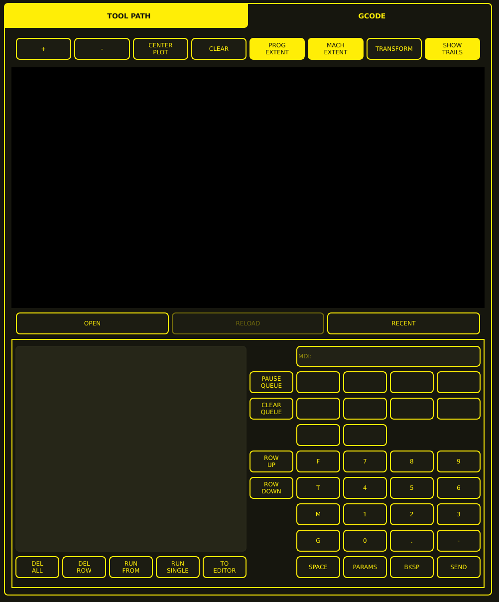

# MDI (Manual Data Input)

The MDI area combines a tool-path viewer with controls for loading programs, managing an MDI command queue, entering commands through an on-screen keypad, and sending commands to the machine controller.

## Layout Overview

The MDI area is divided into two principal horizontal sections:

1. **Tool Path viewer** — upper portion with toolbar and plotting area
2. **MDI command and queue workspace** — lower portion with command queue, input field, and on-screen keypad

---

## Tool Path / G-code Tabs

Two tabs span the top of the screen:

- **TOOL PATH** — filled yellow, selected view showing the plotted geometry
- **GCODE** — dark background with yellow text, alternate view for raw G-code

---

## Tool-path Toolbar

Eight controls appear below the tabs:

| Control         | Description                                 |
| --------------- | ------------------------------------------- |
| **+**           | Increase the plot scale (zoom in)           |
| **-**           | Decrease the plot scale (zoom out)          |
| **CENTER PLOT** | Centre the plotted geometry in the viewport |
| **CLEAR**       | Clear the visible plot                      |
| **PROG EXTENT** | Fit or display the program extents          |
| **MACH EXTENT** | Fit or display the machine extents          |
| **TRANSFORM**   | Access plot or coordinate transformation    |
| **SHOW TRAILS** | Display tool or movement trails             |

Some buttons (PROG EXTENT, MACH EXTENT, SHOW TRAILS) appear filled yellow, indicating an active state.

---

## Tool-path Viewport

A large black rectangular viewport displays the program geometry. No tool path or part geometry is visible when no program is loaded.

---

## Program File Controls

Three buttons below the viewport manage program files:

| Button     | Description                                     |
| ---------- | ----------------------------------------------- |
| **OPEN**   | Open a program file                             |
| **RELOAD** | Reload the current program (may be unavailable) |
| **RECENT** | Access recently opened programs                 |

---

## Command Queue

The lower-left area displays the MDI command queue. Commands entered via the MDI field are added to this list for batch execution.

### Queue Action Buttons

| Button         | Description                                  |
| -------------- | -------------------------------------------- |
| **DEL ALL**    | Delete all commands from the queue           |
| **DEL ROW**    | Delete the selected row from the queue       |
| **RUN FROM**   | Run the queue starting from the selected row |
| **RUN SINGLE** | Run a single command from the queue          |
| **TO EDITOR**  | Transfer queue content to the G-code editor  |

---

## MDI Input

The **MDI:** input field at the top of the lower-right workspace accepts manual G-code commands.

---

## Queue Controls

Two buttons manage the command queue:

| Button          | Description                          |
| --------------- | ------------------------------------ |
| **PAUSE QUEUE** | Pause execution of the command queue |
| **CLEAR QUEUE** | Clear all commands from the queue    |

---

## On-screen Keypad

The lower-right area contains a structured keypad for entering MDI commands via touchscreen.

### Navigation

| Button       | Description                    |
| ------------ | ------------------------------ |
| **ROW UP**   | Move up in the keypad layout   |
| **ROW DOWN** | Move down in the keypad layout |

### Letter Keys

A vertical column of command-letter keys:

- **F** — Feed rate
- **T** — Tool
- **M** — M-code
- **G** — G-code

### Numeric Keys

Calculator-style numeric keypad:

| Row    | Keys          |
| ------ | ------------- |
| Upper  | `7`, `8`, `9` |
| Middle | `4`, `5`, `6` |
| Lower  | `1`, `2`, `3` |
| Bottom | `0`, `.`, `-` |

### Command Controls

The bottom row contains:

| Button     | Description                                  |
| ---------- | -------------------------------------------- |
| **SPACE**  | Insert a space                               |
| **PARAMS** | Access parameter values                      |
| **BKSP**   | Backspace — delete last character            |
| **SEND**   | Submit the command to the machine controller |

---

## Using MDI

### Basic Entry

1. Type a G-code command using the on-screen keypad or the MDI input field.
2. Press **SEND** to execute the command.

### Queueing Commands

1. Enter commands via the MDI field or keypad.
2. Commands are added to the queue list.
3. Use queue controls to manage execution:
   - **RUN SINGLE** — execute one command at a time
   - **RUN FROM** — start execution from a selected row
   - **PAUSE QUEUE** / **CLEAR QUEUE** — control queue execution
   - **DEL ROW** / **DEL ALL** — remove commands from the queue
   - **TO EDITOR** — transfer queue content to the editor

### Common MDI Commands

| Command            | Description                      |
| ------------------ | -------------------------------- |
| `G0 Z50`           | Rapid Z to 50 mm                 |
| `G1 Z5 F25`        | Linear Z to 5 mm at 25 mm/min    |
| `M3`               | Torch on                         |
| `M5`               | Torch off                        |
| `G10 L2 P0 R5`     | Rotate WCS by 5 degrees          |
| `G10 L20 P0 X0 Y0` | Set WCS zero at current position |
| `G92 Z0`           | Set Z offset to zero             |

---

## MDI Limitations

- MDI commands are executed immediately and cannot be undone.
- Complex G-code programs should be loaded as files rather than entered via MDI.
- Some plasma-specific G-codes may require special handling — see the
  [G-code Syntax](../reference/gcode-syntax.md) reference.
