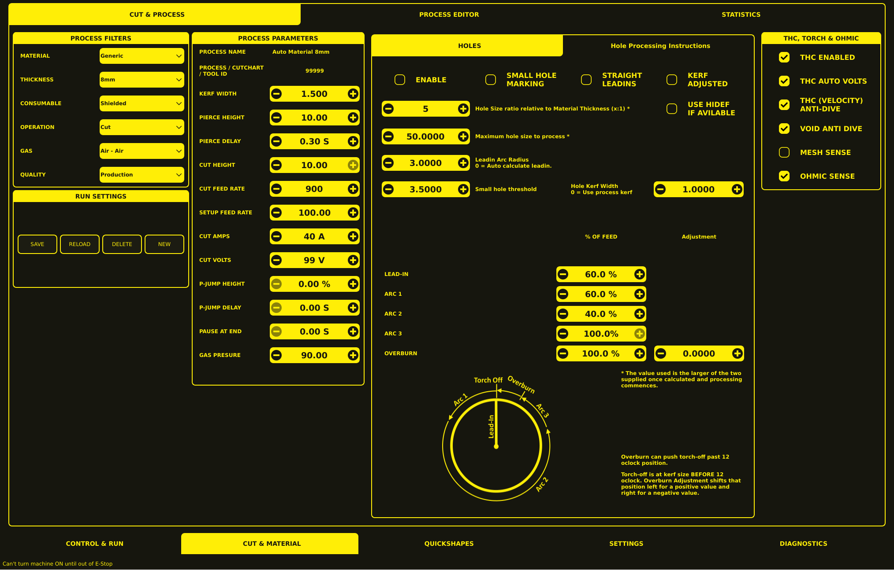

# Parameters

The Parameters tab (on the **CUT & MATERIAL** section) manages cut parameters through a filter-based system backed by a SQLite database.



## Layout Overview

The screen is divided into four main areas:

1. **Process Filters & Run Settings** — left column
2. **Process Parameters** — centre-left
3. **Hole Processing** — centre-right
4. **THC, Torch & Ohmic** — far right

---

## Process Filters

The **Process Filters** panel contains six dropdown selectors used to narrow down the cut process database:

| Filter         | Description                  | Example Values |
| -------------- | ---------------------------- | -------------- |
| **Material**   | Material type                | Generic        |
| **Thickness**  | Material thickness           | 8mm            |
| **Consumable** | Tip/wheel/Nozzle combination | Shielded       |
| **Operation**  | Type of operation            | Cut            |
| **Gas**        | Cutting gas type             | Air - Air      |
| **Quality**    | Cut quality setting          | Production     |

These selections define the displayed cutting-process configuration. The SUB-LIST below the filters shows all matching cut entries.

---

## Run Settings

The **Run Settings** panel contains four action buttons for managing process records:

- **SAVE** — Save changes to the currently selected cut.
- **RELOAD** — Reload the selected cut from the database.
- **DELETE** — Remove the selected cut from the database.
- **NEW** — Create a new cut entry.

---

## Process Parameters

The **Process Parameters** panel displays the selected process identity and its main cutting values.

### Process Identification

| Field                            | Description                       |
| -------------------------------- | --------------------------------- |
| **Process Name**                 | Display name for the process      |
| **Process / Cutchart / Tool ID** | Unique identifier for the process |

### Editable Parameters

Each numeric field uses a minus / value / plus control for adjustment.

| Parameter           | Description                                          |
| ------------------- | ---------------------------------------------------- |
| **Kerf Width**      | Width of the cut (used for path compensation)        |
| **Pierce Height**   | Distance from workpiece to torch at pierce           |
| **Pierce Delay**    | Time torch stays on at pierce height before lowering |
| **Cut Height**      | Torch distance from workpiece during cutting         |
| **Cut Feed Rate**   | Cutting speed (mm/min or in/min)                     |
| **Setup Feed Rate** | Feed rate for setup / rapid movements                |
| **Cut Amps**        | Plasma current (requires RS485 communications)       |
| **Cut Volts**       | Expected arc voltage during cut                      |
| **P-Jump Height**   | Piercing jump height (percentage)                    |
| **P-Jump Delay**    | Piercing jump delay (seconds)                        |
| **Pause at End**    | Pause time at end of cut (seconds)                   |
| **Gas Pressure**    | Gas pressure setting                                 |

---

## Hole Processing

The **Holes** panel configures how circular holes are cut.

### Hole Processing Options

Five checkboxes control hole-processing behaviour:

- **Enable** — Enable hole processing for this process.
- **Small Hole Marking** — Use marking (arc start) for small holes.
- **Straight Leadins** — Use straight lead-in paths instead of arcs.
- **Kerf Adjusted** — Adjust kerf for hole cutting.
- **Use Hidef if Available** — Use high-definition consumables for holes if available.

### Hole Size & Lead-in Values

| Parameter                | Description                                             |
| ------------------------ | ------------------------------------------------------- |
| **Hole Size ratio**      | Hole size relative to Material Thickness (x:1)          |
| **Maximum hole size**    | Maximum hole size to process with special handling      |
| **Leadin Arc Radius**    | Radius of the arc lead-in (`0` = auto calculate leadin) |
| **Small hole threshold** | Threshold below which small-hole processing is applied  |
| **Hole Kerf Width**      | Kerf width for holes (`0` = use process kerf)           |

### Path Segment Feed Percentages

The **% of Feed** section lets you adjust cutting speed for different segments of a hole cut:

| Path Segment | % of Feed | Adjustment | Description                                                 |
| ------------ | ---------:| ----------:| ----------------------------------------------------------- |
| **Lead-in**  | `60.0 %`  | —          | Speed during the lead-in arc                                |
| **Arc 1**    | `60.0 %`  | —          | Speed during the first arc segment                          |
| **Arc 2**    | `40.0 %`  | —          | Speed during the second arc segment                         |
| **Arc 3**    | `100.0 %` | —          | Speed during the third arc segment                          |
| **Overburn** | `100.0 %` | `0.0000`   | Speed during overburn; Adjustment shifts torch-off position |

> **Note:** The value used is the larger of the two supplied, once calculated and processing commences.

### Overburn Explanation

> Overburn can push torch-off past 12 o'clock position.
> 
> Torch-off is at kerf size BEFORE 12 o'clock. Overburn Adjustment shifts that position left for a positive value and right for a negative value.

---

## THC, Torch & Ohmic

The **THC, Torch & Ohmic** panel configures torch-height-control and sensing options. Each setting is a checkbox:

| Setting                      | Description                               |
| ---------------------------- | ----------------------------------------- |
| **THC Enabled**              | Enable torch-height control               |
| **THC Auto Volts**           | Auto-set THC voltage based on process     |
| **THC (Velocity) Anti-Dive** | Prevent torch dive during arc initiation  |
| **Void Anti Dive**           | Anti-dive behaviour for void cuts         |
| **Mesh Sense**               | Enable mesh sensing (for uneven surfaces) |
| **Ohmic Sense**              | Enable ohmic sensing for height detection |

---

## Bottom Navigation Bar

The application navigation bar runs along the bottom of the screen:

- **Control & Run**
- **Cut & Material** — active section (shown highlighted)
- **Quickshapes**
- **Settings**
- **Diagnostics**

---

## Using the Parameters

1. **Select filter values** — Use the dropdowns in the Process Filters panel to select each field.
2. **View matching cuts** — The SUB-LIST below the filters shows all matching cut entries.
3. **Select a cut** — Click a row in the SUB-LIST to load its parameters.
4. **Edit parameters** — Modify values in the Process Parameters or Hole Processing panels.
5. **Save changes** — Click **SAVE** in the Run Settings panel.
6. **Create a new cut** — Click **NEW**, set all filter fields, enter the desired parameters, and click **SAVE**.
7. **Delete a cut** — Select the cut from the SUB-LIST and click **DELETE**.

---

## Database

The process database is stored in `plasma_table.db` (SQLite format).

### Seeding from CSV

A seed CSV file (`master-seed-source.csv`) is provided in the config directory. The database is automatically populated on first run if seed data exists.

### Backup

```bash
cp plasma_table.db plasma_table.db.backup
```

### Editing

```bash
sqlite3 plasma_table.db "SELECT * FROM cuts WHERE material = 'Mild Steel';"
```
