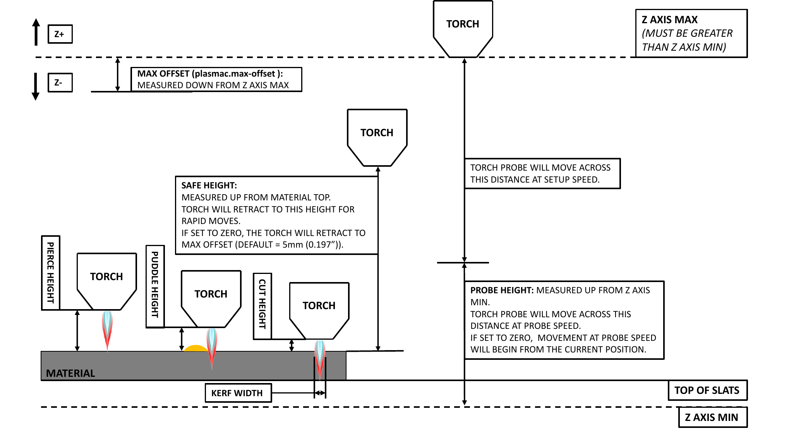
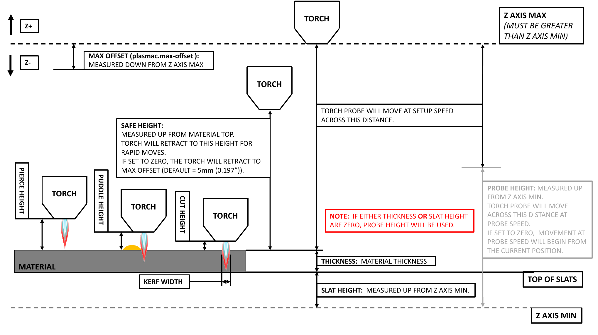

# Probe

Probing establishes the Z zero reference at the workpiece surface. MonoKrom Plasma supports
two probing methods: ohmic probe (primary) and float switch (fallback).

## Probing Methods

### Ohmic Probe

The ohmic probe uses electronic touch-off. Voltage is applied to the torch consumable, and
when the torch contacts (or comes very close to) the workpiece, a circuit is completed through
the material. The system detects this circuit and records the Z position.

**Requirements:**

- Ohmic probe input connected to a breakout board digital input
- Ohmic probe enable output connected to control the ohmic probe circuit
- **Ohmic Probe Enable** checkbox checked on the Settings tab

**HAL Pins:**
| Pin | Direction | Description |
|-----|-----------|-------------|
| `plasmac.ohmic-probe` | Input | Ohmic probe signal from breakout board |
| `plasmac.ohmic-enable` | Output | Enable signal for ohmic probe circuit |

### Float Switch

The float switch is a mechanical switch on the torch floating head. When the torch contacts
the workpiece, the float switch activates and stops the Z axis descent.

**Requirements:**

- Float switch input connected to a breakout board digital input
- No ohmic probe installed (or used as fallback when ohmic fails)

**HAL Pins:**
| Pin | Direction | Description |
|-----|-----------|-------------|
| `plasmac.float-switch` | Input | Float switch signal from breakout board |

## Probe Test Workflow

The Probe Test cycle verifies and calibrates the probing setup. Follow this procedure after
initial machine setup or when probing results seem inaccurate.

### Prerequisites

1. Machine is homed.
2. Machine is in the home position (X0, Y0).
3. Nothing is below the torch (for safety during initial test).
4. Z axis MIN_LIMIT is set correctly (just below the top of the slats).

### Calibration Steps

1. **Set probe parameters** — On the Settings tab, verify:
   
   - Probe Speed is appropriate for your machine (default: 300 mm/min)
   - Probe Height is set near the Z axis minimum (default: 14.0 mm)

2. **Position material** — Place a piece of scrap material on the slats under the torch.

3. **Run Probe Test** — Click the **PROBE TEST** button on the Probe tab.

4. **Observe the cycle:**
   
   - Z axis probes down at probe speed
   - When the workpiece is detected (ohmic or float switch), Z stops
   - Z moves up to the pierce height for the currently selected material
   - Torch holds at pierce height for 10 seconds (configurable in `.prefs` file)
   - Z returns to the starting height

5. **Measure the gap** — While the torch is holding at pierce height, measure the actual
   distance between the torch tip and the material surface.

6. **Adjust Float Travel:**
   
   - If measured distance > pierce height: **reduce** Float Travel by the difference
   - If measured distance < pierce height: **increase** Float Travel by the difference

7. **Repeat** — Run Probe Test again and verify the measurement matches the pierce height.
   Repeat until accurate.

### Calculating Overrun

If your machine has sufficient float switch travel to absorb Z axis overrun during probing,
you can set Probe Height near the Z axis minimum and probe at full speed. Overrun can be
calculated:

```
o = 0.5 * a * (v / a)^2
```

Where:

- `o` = overrun (mm or inches)
- `a` = Z axis acceleration (mm/s² or in/s²)
- `v` = Z axis velocity during probing (mm/s or in/s)

**Metric example:** MAX_ACCELERATION = 600 mm/s², MAX_VELOCITY = 60 mm/s → overrun = 3 mm

**Imperial example:** MAX_ACCELERATION = 24 in/s², MAX_VELOCITY = 2.4 in/s → overrun = 0.12 in

## Height Reference Diagrams

### Probe Height Only

When using probe height only (no slat height + material thickness):



Probe height is measured from the Z axis MIN_LIMIT upward.


### Slat Height + Material Thickness

When using slat height and material thickness:



In this mode, the slat height is set in the INI file:

```ini
[PLASMAC]
SLAT_TOP = -65.0
```
> **Image source:** These diagrams are sourced from the opensource [QtPlasmac documentation](https://linuxcnc.org/docs/devel/html/plasma/qtplasmac.html).

## Z Zero Setup

To set the Z DRO relative to Z MIN_LIMIT (making probe height visualization easier):

1. Home the Z axis.
2. Jog Z down until it stops at Z MIN_LIMIT.
3. Click the `0` button next to the Z DRO to touch off (set Z = 0).
4. Home the Z axis again.

Now the Z DRO value represents the distance above Z MIN_LIMIT, making it easy to visualize
probe height settings.

**Important:** Touching off the Z DRO has no effect on Z position while running a G-code
program. It only affects the displayed value.

## Ohmic Probe Calibration

If you have an ohmic probe, you must also calibrate the X/Y offset between the ohmic probe
tip and the torch consumable center. See [Sheet Alignment](sheet-alignment.md) for details
on applying offsets.

## Troubleshooting Probing

| Problem                        | Possible Cause          | Solution                                                                             |
| ------------------------------ | ----------------------- | ------------------------------------------------------------------------------------ |
| Probe never triggers           | Ohmic probe not enabled | Check **Ohmic Probe Enable** on Settings tab                                         |
| Probe triggers too early       | Contact bounce          | Increase debounce delay in HAL (see [Troubleshooting](../troubleshooting.md))        |
| Probe triggers too late        | Float switch stuck      | Check mechanical switch movement                                                     |
| Probe crashes into material    | Float Travel incorrect  | Run Probe Test calibration                                                           |
| Ohmic probe fails consistently | Dirty workpiece surface | Clean workpiece, increase ohmic retries                                              |
| Inconsistent probe results     | Arc interference        | Enable low-pass filter on arc voltage (see [Troubleshooting](../troubleshooting.md)) |
