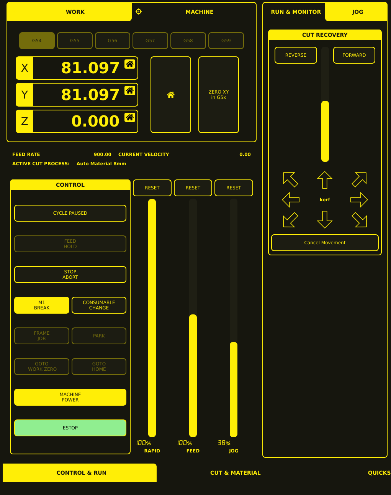

# Cut Recovery

Cut Recovery allows you to manually reposition the torch after a cut has been interrupted
(feed hold). This is essential for recovering from dropped arcs, voids, or operator errors
without restarting the entire program.

## Activating Cut Recovery

1. **Interrupt the cut** — Press **FEED HOLD** during a cut, or the cut may be interrupted
   by a void detection, arc loss, or other error.
2. **Access Recovery controls** — The Cut Recovery controls appear in the **JOG** tab on the
   right side of the interface when a cut is paused (display shows **CYCLE PAUSED**).
3. **Reposition the torch** — Use the recovery controls to move the torch back to the cut path.
4. **Resume cutting** — Press **CYCLE START** to resume from the recovery point.

## Cut Recovery Controls

The Cut Recovery panel appears in the **JOG** tab (next to the **RUN & MONITOR** tab) and
contains the following controls:

| Control                | Description                                                                                                |
| ---------------------- | ---------------------------------------------------------------------------------------------------------- |
| **REVERSE**            | Move backward through the cut-recovery sequence                                                            |
| **FORWARD**            | Move forward through the cut-recovery sequence                                                             |
| **Vertical slider**    | Adjustable recovery control positioned between REVERSE and FORWARD                                         |
| **Directional arrows** | Eight arrows arranged around the central "kerf" label for repositioning in cardinal or diagonal directions |
| **Cancel Movement**    | Cancels recovery movement                                                                                  |

## Recovery Workflow

### Standard Recovery

1. **Cut is interrupted** — Feed hold is active, machine is paused (display shows **CYCLE PAUSED**).
2. **Assess the situation** — Look at the VTK backplot to see where the cut stopped relative
   to the program path.
3. **Access recovery controls** — Open the **JOG** tab to reveal the Cut Recovery panel.
4. **Reposition the torch** — Use the directional arrows and REVERSE/FORWARD controls to
   move the torch to a point slightly before the interruption point (to re-establish the arc properly).
5. **Verify position** — Check the DRO values and VTK backplot to confirm position.
6. **Resume** — Press **CYCLE START**. The machine resumes cutting from the current position.

### Recovery After Void Detection

When THC void detection retracts the torch:

1. **Torch is at safe height** — Void detection has already retracted Z.
2. **Move XY to restart point** — Use the recovery directional arrows to position over the cut path.
3. **Lower Z** — Manually jog Z down to cut height (or use the DRO touch-off).
4. **Resume** — Press **CYCLE START**.

### Canceling Recovery

To cancel recovery movement without resuming:

1. Press **Cancel Movement** — This cancels the recovery movement request.
2. The program must be restarted from the beginning or from a specific line.
