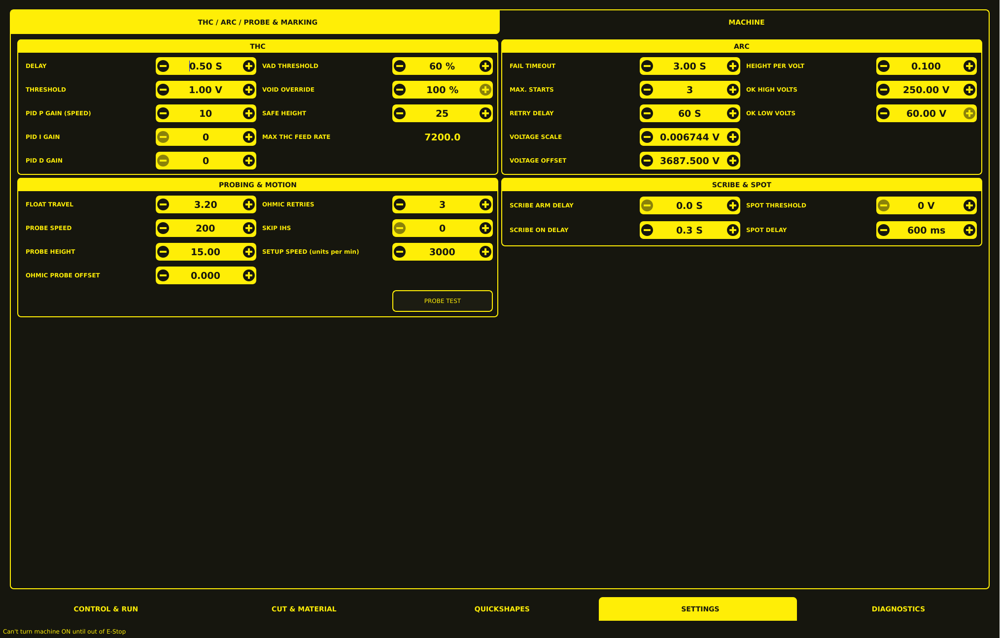
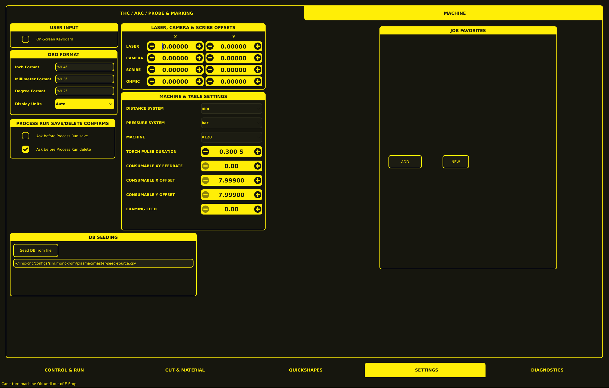

# Settings

The Settings section provides configuration controls organized into two tabs: **THC / ARC / PROBE & MARKING** and **MACHINE**.



---

## THC / ARC / PROBE & MARKING

This tab groups controls by function rather than panel layout. Each section explains what the setting does, when to adjust it, and what happens if it is set incorrectly.

### Torch Height Control

THC keeps the torch at the correct height during cutting by reading arc voltage and moving the Z axis. These settings define how aggressively and quickly the system responds.

**Delay** — How long the system waits after arc transfer before THC starts making corrections. If set too low, the Z axis will react to pierce instability and oscillate. If set too high, the system will respond slowly to real height changes.

**Threshold** — The voltage variation window around the target voltage. The THC ignores voltage fluctuations within this range and only moves the Z axis when the voltage drifts beyond it. A threshold that is too high makes the system sluggish; too low makes it react to electrical noise.

**PID P Gain (Speed)** — The proportional gain controls how strongly the Z axis reacts to voltage error. Higher values give faster correction but risk oscillation. Start at zero and increase in small steps until the Z axis responds to voltage changes, then back off by 20–30% for stability.

**PID I Gain** — The integral gain eliminates persistent height drift over long cuts by accumulating small errors over time. Set only if you notice the torch gradually drifting during extended cuts. Too much I causes slow oscillation.

**PID D Gain** — The derivative gain dampens rapid voltage changes and reduces oscillation. Most machines run well with D at zero. Increase only if P causes oscillation that I alone cannot stabilize.

| Setting | Tuning tips | Default |
| --- | --- | --- |
| Delay | Too short → oscillation during pierce. Too long → slow response. | `0.50 S` |
| Threshold | Too high → sluggish. Too low → noise-driven movement. | `1.00 V` |
| PID P Gain (Speed) | Start at 0, increase until Z responds, back off 20–30%. Too high → oscillation. | `10` |
| PID I Gain | Set only if drift occurs. Too high → slow oscillation. | `0` |
| PID D Gain | Set only if oscillation persists. Too high → jittery Z. | `0` |

**Safe Height** — A hard lower limit on Z during cutting. The THC will never command the torch below this height, even if voltage readings suggest it should. Set this slightly above the slat top to prevent crashes if THC malfunctions.

**Max THC Feed Rate** — The upper limit on feed rate when THC is actively controlling height. This value is displayed as plain text rather than an adjustable control. If set too high, the THC may not be able to keep up with fast cuts.

| Setting | Purpose | Default |
| --- | --- | --- |
| Safe Height | Hard lower Z limit during cutting. Set above slat top. | `25` |
| Max THC Feed Rate | Upper speed limit for THC-controlled cutting. | `7200.0` |

---

### Arc Detection and Validation

These settings control how the system detects that the arc has started and how it validates the arc voltage signal.

**Fail Timeout** — How long the system waits for arc transfer after commanding the torch on. If no arc OK signal arrives within this window, the cut is aborted and an error is displayed. Too short a timeout causes false aborts on difficult materials.

**Max. Starts** — The number of arc start attempts before the system gives up and reports an error. Some materials or consumables may require multiple attempts.

**Retry Delay** — How long the system waits between arc start attempts. A longer delay gives the plasma more time to cool between attempts.

**Voltage Scale** and **Voltage Offset** — Calibration values that convert the raw arc voltage input into a readable value. These are typically set once during initial setup and rarely changed. The scale is a multiplier and the offset is a constant added to the reading. If the displayed arc voltage does not match a multimeter reading, adjust these values.

| Setting | Purpose | Default |
| --- | --- | --- |
| Fail Timeout | Abort if arc does not transfer within this time. Too short → false aborts. | `3.00 S` |
| Max. Starts | Attempts before giving up. Increase for difficult materials. | `3` |
| Retry Delay | Wait between start attempts. | `60 S` |
| Voltage Scale | Calibration multiplier for arc voltage reading. | `0.006744 V` |
| Voltage Offset | Calibration constant added to arc voltage reading. | `3687.500 V` |

**Height Per Volt** — The distance the Z axis must move to change arc voltage by one volt. This is used by manual height controls and for initial THC calibration. The minus button is visibly muted in the UI, suggesting it may be a read-only or protected value.

**OK High Volts** and **OK Low Volts** — Voltage boundaries used in Mode 0 (soft arc OK) to determine whether the arc is present. OK High is the minimum voltage considered a valid arc; OK Low is the maximum voltage below which the arc is considered lost. The plus button beside OK Low is muted in the UI.

| Setting | Purpose | Default |
| --- | --- | --- |
| Height Per Volt | Z movement per volt of arc voltage change. | `0.100` |
| OK High Volts | Minimum voltage for valid arc (Mode 0 soft arc OK). | `250.00 V` |
| OK Low Volts | Maximum voltage below which arc is considered lost (Mode 0). | `60.00 V` |

---

### Height Sensing and Probing

These settings control how the system finds the workpiece surface before cutting begins.

**Float Travel** — The distance the float switch physically travels when it activates. This value is critical for accurate probing because the system uses it to calculate where the material surface is. Set this by running a Probe Test and adjusting until the measured distance between material and torch tip matches the configured Pierce Height.

**Probe Speed** — How fast the Z axis moves during probing. Higher speeds are acceptable if the float switch has enough travel to absorb Z overrun. Overrun can be estimated as `0.5 × acceleration × (velocity / acceleration)²`.

**Probe Height** — The Z height the system moves to before beginning the probe search. The probe then moves down from this height to find the material.

**Ohmic Probe Offset** — The distance above the material the torch moves to after a successful ohmic probe. This compensates for high probing speeds and accounts for consumable tip height.

**Ohmic Retries** — Number of times the system attempts ohmic probing before falling back to the float switch. Increase if ohmic contact is unreliable on dirty or painted surfaces.

**Skip IHS** — If the current Z position is closer to the material than this distance, the system skips the initial height search entirely. Useful when the torch starts near the workpiece. The minus button is muted in the UI.

**Setup Speed** — Z axis velocity for all setup moves (Probe Height, Pierce Height, Cut Height). This is the speed used for non-probing Z movements.

| Setting | Purpose | Default |
| --- | --- | --- |
| Float Travel | Float switch travel distance. Set via Probe Test. | `3.20` |
| Probe Speed | Z velocity during probing. | `200` |
| Probe Height | Starting Z height before probe search. | `15.00` |
| Ohmic Probe Offset | Post-ohmic-probe lift distance. Compensates for probing speed. | `0.000` |
| Ohmic Retries | Ohmic attempts before falling back to float switch. | `3` |
| Skip IHS | Skip initial height search if Z is closer than this distance. | `0` |
| Setup Speed | Z velocity for setup moves (Probe, Pierce, Cut heights). | `3000` |

A **PROBE TEST** button is available at the lower-right of this panel for verifying and calibrating probe configuration. See [Probe Test Workflow](probe.md) for calibration instructions.

---

### Marking and Spotting

**Scribe Arm Delay** — Time between receiving a scribe command and positioning the scribe mechanism. Allows the scribe to reach the material surface before marking.

**Scribe On Delay** — Time between arming the scribe and activating the marking action. A short delay ensures the scribe is stable before contact.

**Spot Threshold** — The arc voltage at which the spot timer begins counting. The torch stays on for the configured Spot Delay after this voltage is reached. The minus button is muted in the UI.

**Spot Delay** — Duration the torch stays on after the spot threshold is reached. This creates a small molten spot useful for identifying cut start points or marking positions.

| Setting | Purpose | Default |
| --- | --- | --- |
| Scribe Arm Delay | Wait before positioning scribe. | `0.0 S` |
| Scribe On Delay | Wait before activating scribe marking. | `0.3 S` |
| Spot Threshold | Voltage that starts the spot timer. | `0 V` |
| Spot Delay | Torch-on time after threshold reached. | `600 ms` |

---

### THC, Torch & Ohmic Controls

The checkboxes on the right side of the Settings page enable or disable THC-related features.

| Checkbox | Effect |
| --- | --- |
| **THC Enabled** | Turns torch height control on or off. Disable for piercing or when arc voltage is unreliable. |
| **THC Auto Volts** | Automatically adjusts the target voltage based on material thickness and cut parameters. |
| **THC (Velocity) Anti-Dive** | Prevents the torch from diving when arc voltage drops suddenly (e.g., at the start of a cut). |
| **Void Anti Dive** | Retracts the torch when a void (gap in material) is detected. |
| **Mesh Sense** | Filters rapid voltage fluctuations caused by cutting expanded metal. |
| **Ohmic Sense** | Enables ohmic probing for workpiece height detection. |

---



---

## MACHINE

The **MACHINE** tab contains user interface preferences, display formatting, machine and table settings, database seeding controls, and job favorites.

### User Input

| Setting | Effect |
| --- | --- |
| **On-Screen Keyboard** | Shows or hides the virtual keyboard used for entering text and numbers. |

---

### DRO Format

Controls how numbers are displayed in the Digital Read Out fields.

| Setting | Effect | Example |
| --- | --- | --- |
| **Inch Format** | Number of decimal places for inch values. `%9.4f` shows four decimal places. | `%9.4f` |
| **Millimeter Format** | Number of decimal places for millimetre values. `%9.3f` shows three decimal places. | `%9.3f` |
| **Degree Format** | Number of decimal places for angle values. `%9.2f` shows two decimal places. | `%9.2f` |
| **Display Units** | Which unit system the DROs show. `Auto` selects based on the current configuration. | `Auto` |

---

### Process Run Confirms

Controls whether the system asks for confirmation before performing potentially destructive operations.

| Setting | Effect |
| --- | --- |
| **Ask before Process Run save** | Prompts before overwriting an existing process. |
| **Ask before Process Run delete** | Prompts before removing a process from the database. |

---

### Laser, Camera & Scribe Offsets

X and Y offsets for auxiliary devices. These shift the coordinate system so that laser pointers, camera alignment, scribe marking, and ohmic probing all reference the same torch position.

| Device | X Offset | Y Offset |
| --- | ---: | ---: |
| **Laser** | Laser pointer X/Y offset from torch center | |
| **Camera** | Camera alignment X/Y offset from torch center | |
| **Scribe** | Scribe mechanism X/Y offset from torch center | |
| **Ohmic** | Ohmic probe X/Y offset from torch center | |

---

### Machine & Table Settings

| Setting | Effect | Example |
| --- | --- | --- |
| **Distance System** | Unit system for all distance values. | `mm` |
| **Pressure System** | Unit system for gas pressure readings. | `bar` |
| **Machine** | Machine model identifier for configuration selection. | `A120` |

| Parameter | Effect | Default |
| --- | --- | --- |
| **Torch Pulse Duration** | How long the initial torch pulse fires at the start of each cut. Helps arc transfer on difficult materials. | `0.300 S` |
| **Consumable XY Feedrate** | Speed for XY movement when positioning for consumable changes. | `0.00` |
| **Consumable X Offset** | X position where consumable changes occur. | `7.99900` |
| **Consumable Y Offset** | Y position where consumable changes occur. | `7.99900` |
| **Framing Feed** | Speed for framing (outline) operations. | `0.00` |

---

### Database Seeding

The **DB SEEDING** panel loads default cut parameters into the process database from a CSV file.

- **Seed DB from file** — Imports cut parameters from the configured CSV file.
- **Seed source path** — Location of the CSV file, e.g.:

```
~/linuxcnc/configs/sim.monokrom/plasmac/master-seed-source.csv
```

---

### Job Favorites

The **JOB FAVORITES** panel stores frequently used processes for quick selection during operation.

- **Add** — Saves the current process to the favorites list.
- **New** — Creates a new empty favorite entry.

---

## Persistent Settings

All settings on both tabs are saved to the persistent settings file (pickle format) and restore automatically on VCP restart. The settings file is located at:

```
<machine_name>.prefs
```
